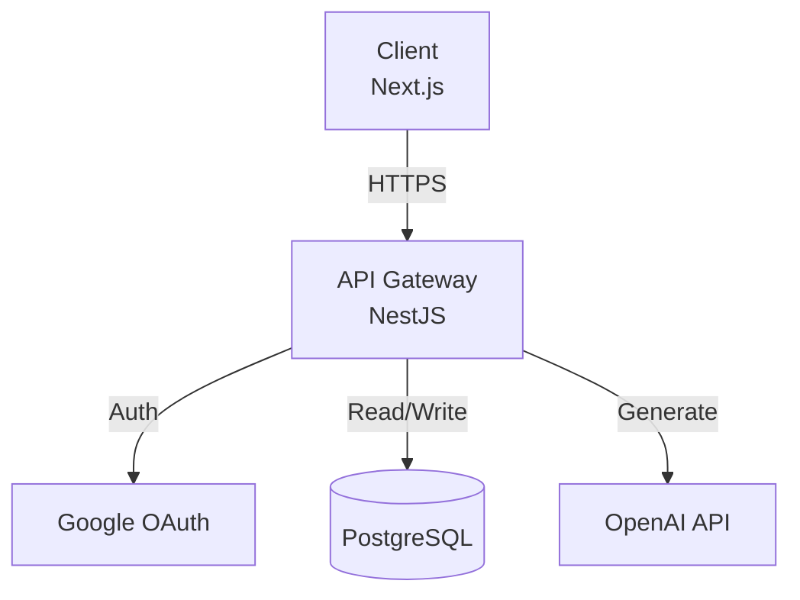

# Re:MirAI

> **"다른 사람의 눈을 통해 자신을 발견하는 플랫폼"**
> **"A platform where you discover yourself through the eyes of others"**


**Project Type:** AI-Powered Personality Discovery Platform  
**Status:** In Development (Phase 1: MVP - ver2 Design Complete)  
**Last Updated:** 2025-11-28

---

## Quick Start

### Prerequisites
- Node.js 18+
- PostgreSQL 15+
- OpenAI API Key

### Installation

```bash
# Clone the repository
git clone https://github.com/salieri009/Re-MirAI.git
cd Re-MirAI

# Install dependencies (Frontend)
cd frontend
npm install

# Install dependencies (Backend)
cd ../backend
npm install
```

### Running Locally

```bash
# Start Backend (NestJS)
cd backend
npm run start:dev
# Server running at http://localhost:3000

# Start Frontend (Next.js) - in a separate terminal
cd frontend
npm run dev
# Client running at http://localhost:3001 (or next available port)
```

**Note:** Make sure PostgreSQL is running and `DATABASE_URL` is configured in `backend/.env`. See [BACKEND_SETUP.md](BACKEND_SETUP.md) for detailed setup instructions.

---

## Architecture

### High-Level Diagram



### Core Components

#### Frontend (Next.js)
- **App Router:** Server Components for performance.
- **Design System:** ver2 "Digital Mirror" system (Dark theme, 3-color palette).
- **State Management:** React Context + Hooks, Zustand.

#### Backend (NestJS)
- **API:** RESTful endpoints for Surveys, Personas, and Chat.
- **Database:** Prisma ORM with PostgreSQL.
- **AI Service:** Integration with OpenAI GPT-4 for persona synthesis.

---

## Project Structure

```
Re-MirAI/
├── frontend/          # Next.js Application
│   ├── src/
│   │   ├── app/       # App Router Pages
│   │   ├── components/# Reusable UI Components (atoms, molecules, organisms)
│   │   ├── lib/       # Utilities & API Clients
│   │   └── styles/    # Global styles & design tokens
├── backend/           # NestJS API Server
│   ├── src/
│   │   ├── modules/   # Feature Modules (Auth, Survey, Persona, Chat)
│   │   ├── prisma/    # Database Schema & Migrations
│   │   └── main.ts    # Application entry point
│   └── prisma/
│       └── schema.prisma  # Prisma schema definition
├── docs/              # Project Documentation
│   ├── 01-concept/    # Initial PRD & Concepts
│   ├── 02-project-overview/ # Features, Goals & Roadmap
│   ├── 03-planning/   # Technical Specs & UI/UX Design
│   ├── 04-user-experience/ # UX Flows & Journey Maps
│   ├── 05-analysis/   # UX/UI Expert Analysis
│   ├── 06-team/       # Team Roles & Competencies
│   ├── 07-Enhancement/# ver1 / ver2 enhancement packs
│   └── 08-Connectivity-and-Deployment/ # FE-BE connectivity & deployment
└── README.md          # This file
```

---

## Key Features

### Survey System (F-001)
- Create personalized "Survey" links.
- Collect anonymous feedback from friends.
- Real-time response tracking.

### Persona Synthesis (F-002)
- Transform feedback into a unique AI Persona.
- "Fated" (Automatic) or "Alchemic" (Guided) creation modes.
- Generates distinct personality traits and archetypes.

### AI Chat Interface (F-003)
- Chat with your synthesized persona.
- Context-aware responses based on survey data.
- Deepen the bond through interaction.

### Persona Card (F-004)
- Beautiful, shareable summary of your persona.
- Includes AI-generated illustration and key stats.
- Optimized for social media sharing.

---

## Tech Stack

### Frontend
- **Framework:** Next.js 14+ (App Router)
- **Language:** TypeScript
- **Styling:** CSS Modules + Tailwind CSS (ver2 Digital Mirror Design System)
- **Animations:** GSAP 3.x + Canvas API
- **State Management:** React Context + Hooks, Zustand (planned)

### Backend
- **Framework:** NestJS
- **Database:** PostgreSQL 15+
- **ORM:** Prisma
- **Authentication:** JWT (Access + Refresh tokens), Google OAuth 2.0
- **API:** RESTful endpoints with Swagger documentation

### AI & Cloud
- **LLM:** OpenAI GPT-4 / GPT-3.5
- **Image Gen:** DALL-E 3 (Planned)
- **Hosting:** Vercel (Frontend), Railway (Backend)

---

## Documentation

All detailed documentation is located in the `docs/` directory.

### Core Documentation

- **Project Overview:** [Project Goals & Features](docs/02-project-overview/README.md)
- **Product Requirements:** [PRD (Project Plan)](docs/01-concept/02-Project-Plan.md)
- **Technical Spec:** [Technical Specification](docs/03-planning/05-Technical-Specification.md)
- **Design System:** [Design Philosophy](docs/02-project-overview/03-Design-Philosophy.md)
- **Roadmap:** [Development Roadmap](docs/02-project-overview/04-Roadmap.md)
- **Feature Specs:** [Core Features Index](docs/02-project-overview/02-Core-Features.md)

### Enhancement Documentation

- **ver2 Enhancement Pack:** [Frontend Refactoring Guide](docs/07-Enhancement/ver2/README.md)
  - Comprehensive page-by-page enhancement specs with animation details
  - Design system updates (color palette, typography, 4px grid)
  - Frontend audit and compliance reports
  - Backend engineering guide

### Connectivity & Deployment

- **[Frontend ↔ Backend Connectivity Test Plan](docs/08-Connectivity-and-Deployment/01-Frontend-Backend-Connectivity-Test-Plan.md)**  
  Maps directly to F-001~F-006 requirements from `docs/02-project-overview/02-Core-Features.md`. Ensures each API flow matches the feature specifications.

- **[Pipeline Strategy](docs/08-Connectivity-and-Deployment/02-Pipeline-Strategy.md)**  
  CI/CD pipeline aligned with growth goals from `docs/02-project-overview/01-Project-Goals.md`. Includes feature flags, blue/green deployments, and rollback procedures.

- **[Deployment Guide](docs/08-Connectivity-and-Deployment/03-Deployment-Guide.md)**  
  Step-by-step instructions for deploying to Railway (Backend) and Vercel (Frontend).

For complete documentation index, see [docs/README.md](docs/README.md).

---

## Team & License

**Re:MirAI Team**
- **Contact:** kordalek@naver.com
