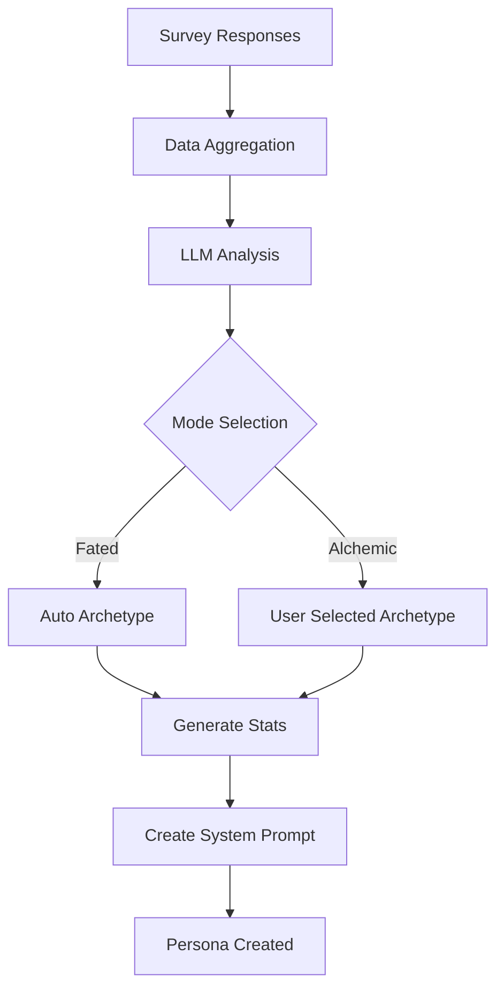

# F-002: Persona Synthesis

**Status:** Active  
**Priority:** P0 (MVP)

## 1. Overview
Persona Synthesis is the AI-driven process that transforms aggregated survey responses into a unique personality profile. It uses LLMs to analyze the data and generate a consistent character with specific traits, archetypes, and dialogue styles.

## 2. Use Cases

### UC-01: Create Persona (Fated Mode)
**Actor:** User  
**Description:** User triggers the synthesis process using the default "Fated" mode.  
**Pre-conditions:** Survey has ≥3 responses.  
**Post-conditions:** A new Persona is created with an AI-determined archetype.

### UC-02: Create Persona (Alchemic Mode)
**Actor:** User (Premium)  
**Description:** User triggers synthesis while applying a specific Archetype Filter (e.g., "Tsundere").  
**Pre-conditions:** Survey has ≥3 responses; User has Premium/Items.  
**Post-conditions:** A new Persona is created with the selected archetype.

## 3. Functional Requirements (FR)

| ID | Requirement | Priority |
| :--- | :--- | :--- |
| **FR-002.1** | The system MUST aggregate numerical scores from survey responses to calculate core stats (Charisma, Intellect, etc.). | P0 |
| **FR-002.2** | The system MUST use an LLM (e.g., GPT-4) to analyze text responses and extract key personality traits. | P0 |
| **FR-002.3** | The system MUST assign one of the defined Archetypes (Yandere, Kuudere, etc.) based on the data. | P0 |
| **FR-002.4** | The system MUST generate a unique System Prompt for the Persona that enforces its personality. | P0 |
| **FR-002.5** | The system MUST support "Alchemic Mode" to allow user influence over the generation process. | P2 |

## 4. Non-Functional Requirements (NFR)

| ID | Requirement | Metric |
| :--- | :--- | :--- |
| **NFR-002.1** | **Performance:** Persona generation MUST complete within 60 seconds. | < 60s |
| **NFR-002.2** | **Reliability:** The generation process MUST have a success rate of >99%. | > 99% |
| **NFR-002.3** | **Consistency:** Re-running synthesis on the exact same data (in Fated Mode) SHOULD produce similar results. | Deterministic-ish |
