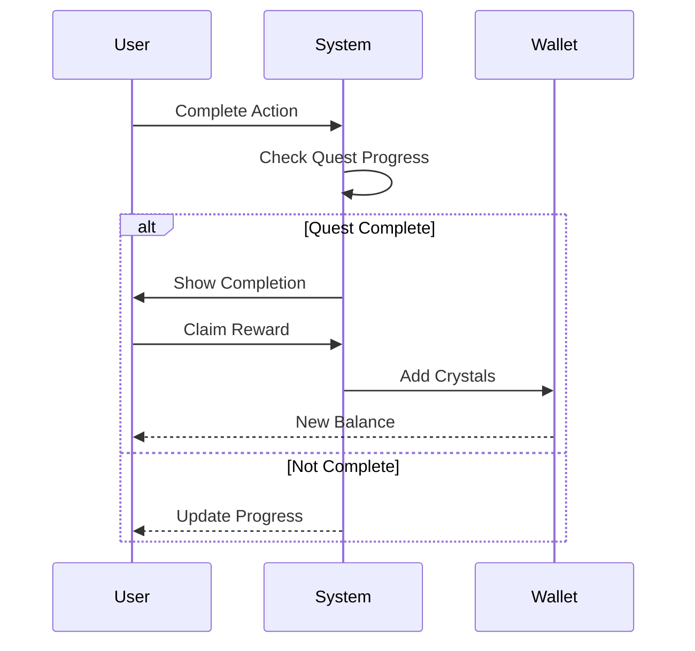

# F-006: Gamification

**Status:** Active  
**Priority:** P2 (Phase 2)

## 1. Overview
Gamification elements are designed to increase user retention and engagement. This includes a Quest System, Daily Login rewards, and the "Memory Crystal" currency system.

## 2. Use Cases

### UC-01: Complete Quest
**Actor:** User  
**Description:** User performs a specific action (e.g., "Share Card") and claims a reward.  
**Pre-conditions:** Quest is active.  
**Post-conditions:** User receives Memory Crystals; Quest is marked complete.

### UC-02: Spend Currency
**Actor:** User  
**Description:** User spends Memory Crystals to unlock premium items or features.  
**Pre-conditions:** User has sufficient balance.  
**Post-conditions:** Item is unlocked; balance is deducted.

## 3. Functional Requirements (FR)

| ID | Requirement | Priority |
| :--- | :--- | :--- |
| **FR-006.1** | The system MUST track user progress against defined Quests. | P2 |
| **FR-006.2** | The system MUST maintain a ledger of user currency (Memory Crystals). | P2 |
| **FR-006.3** | The system MUST support daily login tracking and streak rewards. | P2 |

## 4. Non-Functional Requirements (NFR)

| ID | Requirement | Metric |
| :--- | :--- | :--- |
| **NFR-006.1** | **Integrity:** Currency transactions MUST be transactional and atomic to prevent fraud. | ACID Compliance |
| **NFR-006.2** | **Feedback:** Users MUST receive immediate visual feedback upon quest completion. | Instant Feedback |
