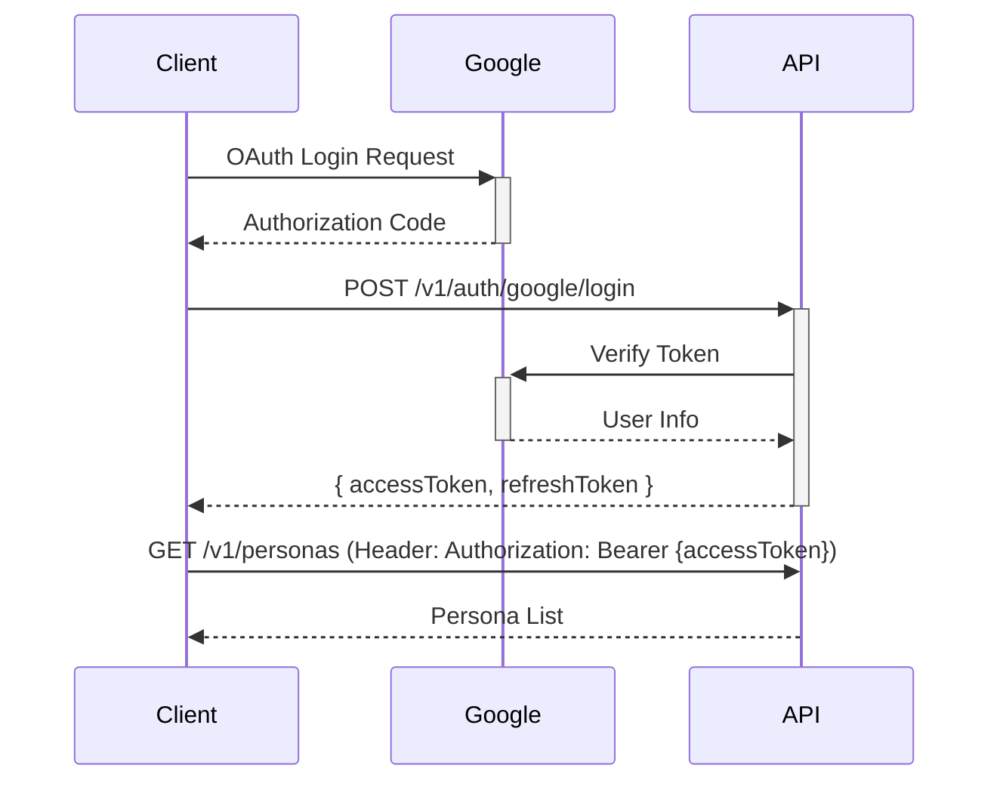

# API Specification

**최종 업데이트:** 2025-11-24  
**버전:** 1.0.0  
**상태:** Draft

---

## 1. 개요

### 1.1. 목적
본 문서는 Re:MirAI 플랫폼의 RESTful API 명세를 정의합니다. 모든 클라이언트-서버 통신은 이 스펙을 준수해야 합니다.

### 1.2. 관련 문서
- [Technical Specification](05-Technical-Specification.md) - 시스템 아키텍처
- [F-001: Survey System](../02-project-overview/features/F-001-Survey-System.md)
- [F-002: Persona Synthesis](../02-project-overview/features/F-002-Persona-Synthesis.md)
- [F-003: Chat Interface](../02-project-overview/features/F-003-Chat-Interface.md)

### 1.3. API 설계 원칙
| 원칙 | 설명 |
| :--- | :--- |
| **RESTful** | Resource 기반 URL 설계, HTTP Method 표준 준수 |
| **Versioning** | URL Prefix (`/v1/`) 사용, 하위 호환성 유지 |
| **Stateless** | 모든 요청은 독립적, JWT 기반 인증 |
| **HTTPS Only** | 모든 통신은 TLS 1.2 이상 암호화 필수 |
| **JSON** | Request/Response Body는 `application/json` |

---

## 2. 인증 및 인가

### 2.1. 인증 흐름 (OAuth 2.0 / JWT)



### 2.2. 엔드포인트

| Method | Endpoint | 설명 | 인증 필요 |
| :--- | :--- | :--- | :---: |
| `POST` | `/v1/auth/google/login` | Google OAuth 로그인 | No |
| `POST` | `/v1/auth/refresh` | Access Token 갱신 | No |
| `POST` | `/v1/auth/logout` | 로그아웃 (토큰 무효화) | Yes |

#### POST /v1/auth/google/login
**Request Body:**
```json
{
  "idToken": "google_id_token_here"
}
```

**Response (200 OK):**
```json
{
  "accessToken": "eyJhbGciOiJI...",
  "refreshToken": "dGhpc2lzcmVm...",
  "user": {
    "id": "uuid",
    "email": "user@example.com",
    "name": "User Name"
  }
}
```

**Errors:**
- `401 Unauthorized`: Invalid Google Token
- `500 Internal Server Error`: Server Error

### 2.3. 인가 (Authorization)
모든 보호된 엔드포인트는 `Authorization` 헤더 필수:
```
Authorization: Bearer {accessToken}
```

---

## 3. Survey System API

### 3.1. 엔드포인트

| Method | Endpoint | 설명 | 인증 |
| :--- | :--- | :--- | :---: |
| `POST` | `/v1/surveys` | Survey 생성 | Yes |
| `GET` | `/v1/surveys/:id` | Survey 정보 조회 (Public) | No |
| `POST` | `/v1/surveys/:id/responses` | 응답 제출 (익명) | No |
| `GET` | `/v1/surveys/:id/status` | 진행 상태 조회 (Owner only) | Yes |

#### POST /v1/surveys
**설명:** 새로운 Survey 생성 (FR-001.1)

**Response (201 Created):**
```json
{
  "id": "uuid",
  "url": "https://remirai.app/s/uuid",
  "status": "ACTIVE",
  "createdAt": "2025-11-24T12:00:00Z"
}
```

**성능 요구사항:** < 1s (NFR-001.2)

#### GET /v1/surveys/:id
**설명:** Survey 메타데이터 및 질문 조회 (공개 액세스)

**Response (200 OK):**
```json
{
  "id": "uuid",
  "questions": [
    {
      "id": 1,
      "type": "likert",
      "text": "이 사람은 사교적인가요?",
      "scale": { "min": 1, "max": 5 }
    }
  ],
  "totalResponses": null
}
```

**Note:** `totalResponses`는 익명성 보호를 위해 Owner에게만 공개 (별도 엔드포인트)

#### POST /v1/surveys/:id/responses
**설명:** 익명 응답 제출 (FR-001.3)

**Request Body:**
```json
{
  "answers": [
    { "questionId": 1, "value": 4 },
    { "questionId": 2, "value": "친절하고 배려심이 많음" }
  ]
}
```

**Response (201 Created):**
```json
{
  "message": "응답이 제출되었습니다."
}
```

**Validation:**
- 중복 제출 방지 (IP/Fingerprint 기반, 24시간)
- 필수 질문 미응답 시 `400 Bad Request`

#### GET /v1/surveys/:id/status
**설명:** Survey 진행 상태 (Owner 전용)

**Response (200 OK):**
```json
{
  "id": "uuid",
  "status": "ACTIVE",
  "responsesCount": 2,
  "canCreatePersona": false,
  "threshold": 3
}
```

---

## 4. Persona API

### 4.1. 엔드포인트

| Method | Endpoint | 설명 | 인증 |
| :--- | :--- | :--- | :---: |
| `POST` | `/v1/personas` | Persona 생성 (Fated/Alchemic) | Yes |
| `GET` | `/v1/personas` | 내 Persona 목록 | Yes |
| `GET` | `/v1/personas/:id` | Persona 상세 조회 | Yes |
| `GET` | `/v1/personas/:id/public` | Public Persona 조회 | No |

#### POST /v1/personas
**설명:** Persona 생성 (FR-002.1~FR-002.4)

**Request Body:**
```json
{
  "surveyId": "uuid",
  "mode": "fated",
  "archetypeFilter": null
}
```

**Request Body (Alchemic Mode):**
```json
{
  "surveyId": "uuid",
  "mode": "alchemic",
  "archetypeFilter": "TSUNDERE"
}
```

**Response (202 Accepted):**
```json
{
  "jobId": "uuid",
  "status": "PROCESSING",
  "estimatedTime": 45
}
```

**성능 요구사항:** < 60s (NFR-002.1)

**Long Polling 지원:**
```
GET /v1/personas/jobs/:jobId
```

#### GET /v1/personas/:id
**설명:** Persona 상세 정보

**Response (200 OK):**
```json
{
  "id": "uuid",
  "name": "친절한 전략가",
  "archetype": "PROTECTOR",
  "rarity": "SR",
  "stats": {
    "charisma": 85,
    "intellect": 72,
    "kindness": 90
  },
  "createdAt": "2025-11-24T12:00:00Z"
}
```

---

## 5. Chat API

### 5.1. 엔드포인트

| Method | Endpoint | 설명 | 인증 |
| :--- | :--- | :--- | :---: |
| `POST` | `/v1/chat/messages` | 메시지 전송 | Yes |
| `GET` | `/v1/chat/:personaId/history` | 대화 기록 조회 | Yes |

#### POST /v1/chat/messages
**설명:** Persona와 대화 (FR-003.1~FR-003.3)

**Request Body:**
```json
{
  "personaId": "uuid",
  "content": "안녕? 오늘 기분이 어때?"
}
```

**Response (200 OK):**
```json
{
  "messageId": "uuid",
  "personaResponse": "안녕! 나는 항상 좋아. 너는 어때?",
  "sentiment": "positive",
  "timestamp": "2025-11-24T12:00:00Z"
}
```

**성능 요구사항:** < 3s (NFR-003.1)

**Content Moderation:** 유해 콘텐츠 감지 시 `400 Bad Request`

#### GET /v1/chat/:personaId/history
**Query Parameters:**
- `limit`: 조회할 메시지 수 (기본: 20, 최대: 100)
- `before`: Cursor 기반 페이지네이션

**Response (200 OK):**
```json
{
  "messages": [
    {
      "id": "uuid",
      "role": "user",
      "content": "안녕?",
      "timestamp": "2025-11-24T11:59:00Z"
    },
    {
      "id": "uuid",
      "role": "persona",
      "content": "안녕!",
      "timestamp": "2025-11-24T12:00:00Z"
    }
  ],
  "nextCursor": "cursor_string"
}
```

---

## 6. Gamification API

### 6.1. 엔드포인트

| Method | Endpoint | 설명 | 인증 |
| :--- | :--- | :--- | :---: |
| `GET` | `/v1/quests` | 활성 퀘스트 목록 | Yes |
| `POST` | `/v1/quests/:id/claim` | 퀘스트 보상 수령 | Yes |
| `GET` | `/v1/currency/balance` | 보유 크리스털 조회 | Yes |

#### POST /v1/quests/:id/claim
**설명:** 퀘스트 완료 및 보상 수령 (FR-006.1~FR-006.2)

**Response (200 OK):**
```json
{
  "reward": {
    "crystals": 50
  },
  "newBalance": 150
}
```

**보안:** ACID 트랜잭션 필수 (NFR-006.1)

---

## 7. 에러 처리

### 7.1. 표준 에러 응답

**형식:**
```json
{
  "error": {
    "code": "ERROR_CODE",
    "message": "사용자 친화적 메시지",
    "details": {
      "field": "surveyId",
      "reason": "Survey not found"
    }
  }
}
```

### 7.2. HTTP 상태 코드

| 코드 | 의미 | 사용 예시 |
| :--- | :--- | :--- |
| `200 OK` | 성공 | GET 요청 성공 |
| `201 Created` | 생성 성공 | POST 성공 |
| `202 Accepted` | 비동기 작업 수락 | Persona 생성 중 |
| `400 Bad Request` | 잘못된 요청 | Validation 실패 |
| `401 Unauthorized` | 인증 실패 | 토큰 없음/만료 |
| `403 Forbidden` | 권한 없음 | 타인의 Persona 접근 |
| `404 Not Found` | 리소스 없음 | 존재하지 않는 ID |
| `429 Too Many Requests` | Rate Limit 초과 | 과도한 요청 |
| `500 Internal Server Error` | 서버 에러 | 예기치 않은 오류 |

---

## 8. Rate Limiting

### 8.1. 정책

| 엔드포인트 | 제한 | 기준 | 복구 시간 |
| :--- | :--- | :--- | :--- |
| `/v1/auth/*` | 10 req/min | IP | 1분 |
| `/v1/surveys` (POST) | 5 req/hour | User | 1시간 |
| `/v1/chat/messages` | 30 req/min | User | 1분 |
| `/v1/*` (Global) | 100 req/min | User | 1분 |

### 8.2. 응답 헤더
```
X-RateLimit-Limit: 100
X-RateLimit-Remaining: 45
X-RateLimit-Reset: 1700000000
```

---

## 9. 페이지네이션

### 9.1. Cursor 기반 (권장)
**Query Parameters:**
- `limit`: 페이지 크기 (기본: 20, 최대: 100)
- `cursor`: 다음 페이지 Cursor

**Response:**
```json
{
  "data": [...],
  "pagination": {
    "nextCursor": "encoded_cursor",
    "hasMore": true
  }
}
```

---

## 10. 참고 자료

- [RESTful API Design Best Practices](https://restfulapi.net/)
- [OAuth 2.0](https://oauth.net/2/)
- [JWT](https://jwt.io/)
- [OpenAPI 3.0 Specification](https://swagger.io/specification/)
