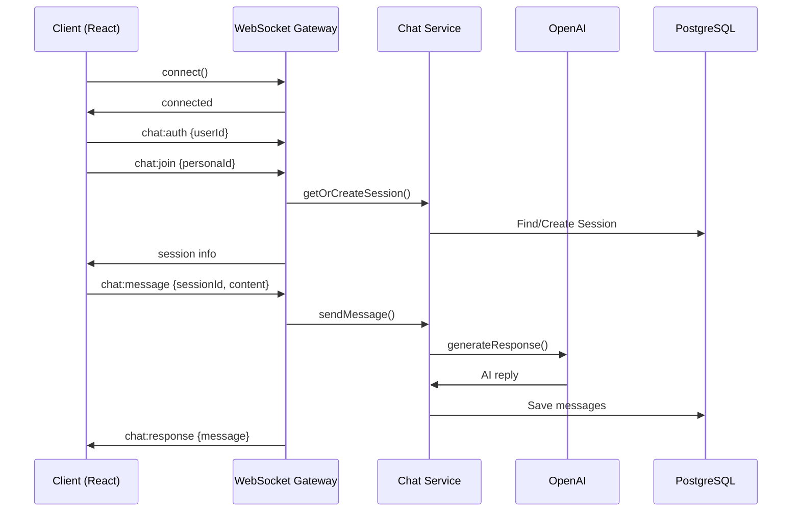

# WebSocket Implementation Guide

**Version:** 1.0.0  
**Date:** 2025-12-27  
**Status:** Active  

---

## 1. Overview

Real-time chat functionality is implemented using Socket.io with NestJS WebSocket Gateway.

---

## 2. Architecture



---

## 3. Events

### Client → Server

| Event | Payload | Description |
|-------|---------|-------------|
| `chat:auth` | `{userId: string}` | Authenticate socket |
| `chat:join` | `{personaId: string}` | Join persona session |
| `chat:message` | `{sessionId: string, content: string}` | Send message |

### Server → Client

| Event | Payload | Description |
|-------|---------|-------------|
| `chat:response` | `{id, sender, content, createdAt}` | AI response |
| `chat:error` | `{error: string}` | Error message |

---

## 4. Backend Implementation

```typescript
// Location: backend/src/modules/chat/chat.gateway.ts

@WebSocketGateway({
  cors: { origin: FRONTEND_URL },
  namespace: '/chat'
})
export class ChatGateway {
  @SubscribeMessage('chat:message')
  async handleMessage(client, data) {
    const result = await chatService.sendMessage(userId, data.sessionId, data.content);
    this.server.to(`session:${data.sessionId}`).emit('chat:response', result.aiMessage);
  }
}
```

---

## 5. Frontend Usage

```typescript
// Connect to WebSocket
const socket = io(`${WS_URL}/chat`);

// Authenticate
socket.emit('chat:auth', { userId });

// Join session
socket.emit('chat:join', { personaId });

// Send message
socket.emit('chat:message', { sessionId, content: 'Hello!' });

// Receive response
socket.on('chat:response', (message) => {
  setMessages(prev => [...prev, message]);
});
```

---

## 6. Error Handling

| Code | Reason | Action |
|------|--------|--------|
| `NOT_AUTHENTICATED` | Missing auth | Re-authenticate |
| `SESSION_NOT_FOUND` | Invalid session | Rejoin session |
| `MODERATION_FAILED` | Content flagged | Show warning |

---

## 7. Performance

- Message context: Last 10 messages
- Response timeout: 30s max
- Reconnection: Auto-retry 5 times
