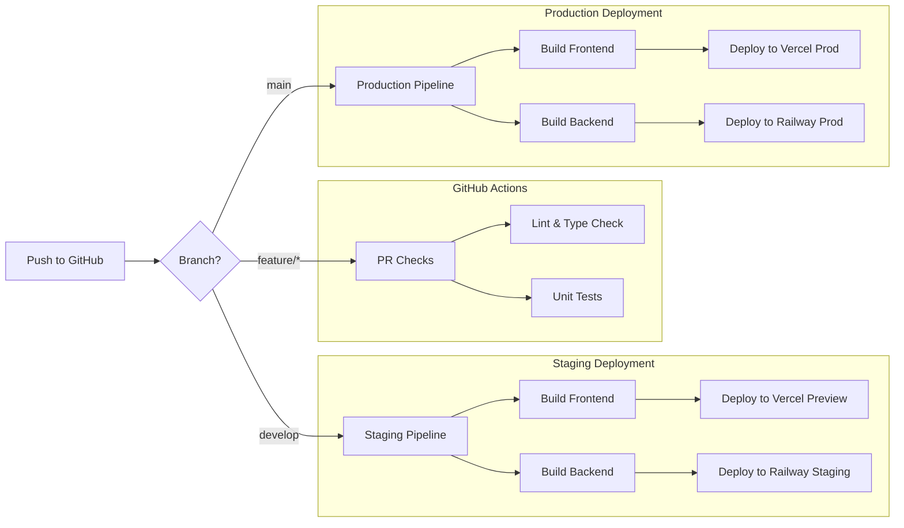

# 02. Pipeline Strategy (FE ↔ BE Deployment)

**Version:** 1.2
**Owners:** DevOps + Platform Team
**Scope:** Build, Test, and Deployment automation for Next.js (Frontend) and NestJS (Backend) using GitHub Actions, Vercel, and Railway.

---

## 1. Goals

1.  **Automated CI/CD**: Consistent build and test pipelines for both applications with shared quality gates (linting, unit tests, type checking).
2.  **Zero-Downtime Deployment**: Leverage Vercel's atomic deployments and Railway's rolling updates to ensure availability.
3.  **Environment Parity**: Maintain strict configuration alignment between Staging and Production environments.
4.  **Feature Assurance**: Ensure critical feature paths (Survey, Persona, Chat) are validated by the pipeline before any code reaches production.

---

## 2. Pipeline Overview

The pipeline utilizes **GitHub Actions** for Continuous Integration (CI) and platform-native integrations (Vercel/Railway) for Continuous Deployment (CD).



---

## 3. CI (Build & Test) Steps

These steps run on every Pull Request and push to main/develop branches.

| Step | Frontend (Next.js) | Backend (NestJS) |
| :--- | :--- | :--- |
| **Install Dependencies** | `npm ci` | `npm ci` |
| **Linting** | `npm run lint` | `npm run lint` |
| **Type Checking** | `npm run typecheck` | `tsc --noEmit` |
| **Unit Tests** | `npm run test` | `npm run test` |
| **Build Verification** | `npm run build` | `npm run build` |

---

## 4. Feature-Specific Pipeline Gates

To ensure the stability of core features defined in `docs/02-project-overview/features`, the following gates are enforced during the **Staging Smoke Test** phase.

### F-001: Survey System Gates
*   **Contract Check**: The `CreateSurveyDto` must match the frontend's `surveyApi.create` payload.
*   **Smoke Test**: A survey created in Staging must successfully generate a public link (Validation of **FR-001.1**).

### F-002: Persona Synthesis Gates
*   **Performance Gate**: The summoning process must complete within 60 seconds. If the smoke test times out, the deployment is marked as **FAILED** (Validation of **NFR-002.1**).
*   **Data Integrity**: The synthesized persona must contain valid stats (Validation of **FR-002.1**).

### F-003: Chat Interface Gates
*   **Latency Check**: The first token of a chat response must be received within 3 seconds. If latency exceeds this threshold in Staging, the deployment is blocked (Validation of **NFR-003.1**).

---

## 5. CD Staging Pipeline

**Trigger**: Push to `develop` branch.

1.  **Backend Deployment (Railway)**:
    *   Railway detects the commit and triggers a build.
    *   **Migration**: `npx prisma migrate deploy` runs automatically during the build or start phase.
    *   **Health Check**: Railway verifies the service is up before routing traffic.

2.  **Frontend Deployment (Vercel)**:
    *   Vercel detects the commit and triggers a "Preview" deployment.
    *   **Environment**: Uses Staging environment variables (pointing to Railway Staging API).
    *   **Verification**: URL is generated (e.g., `remirai-git-develop.vercel.app`) for QA.

3.  **Smoke Tests**:
    *   GitHub Action `frontend-backend-connectivity` runs against the Staging URLs, executing the checks defined in **Section 4**.

---

## 6. Production Deployment Strategy

**Trigger**: Push to `main` branch (or Release Tag).

### 6.1 Backend (Railway)
*   **Strategy**: Rolling Update.
*   **Process**: Railway builds the new container. Once healthy, it replaces the old instance.
*   **Rollback**: Instant rollback to the previous deployment via Railway Dashboard if health checks fail.

### 6.2 Frontend (Vercel)
*   **Strategy**: Atomic Deployment.
*   **Process**: Vercel builds the new version. It is deployed to a unique URL first. Once checks pass, the main domain (`remirai.app`) is updated to point to this deployment.
*   **Rollback**: Instant rollback to the previous deployment ID via Vercel Dashboard.

### 6.3 Database Migrations
*   **Safety**: Migrations are run as part of the deployment process.
*   **Pre-requisite**: Ensure migrations are non-destructive (e.g., add columns, don't rename/delete without a multi-step process).

---

## 7. Automation Details

### 7.1 GitHub Actions Configuration
We use standard actions to ensure code quality before deployment.

**Example: `.github/workflows/ci.yml`**
```yaml
name: CI
on: [push, pull_request]

jobs:
  test:
    runs-on: ubuntu-latest
    steps:
      - uses: actions/checkout@v3
      - name: Setup Node
        uses: actions/setup-node@v3
        with:
          node-version: '18'
      
      - name: Install Dependencies
        run: npm ci
        
      - name: Lint
        run: npm run lint
        
      - name: Test
        run: npm run test
```

### 7.2 Platform Configuration
*   **Vercel**: Connected to GitHub repository. "Framework Preset" set to Next.js.
*   **Railway**: Connected to GitHub repository. "Watch Paths" configured to trigger only on relevant folder changes (e.g., `/backend`).

---

## 8. Rollback & Incident Response

1.  **Automatic Rollback**:
    *   **Vercel**: Automatically cancels deployment if the build fails.
    *   **Railway**: Keeps the previous instance running if the new build fails to start or pass health checks.

2.  **Manual Rollback**:
    *   **Frontend**: Go to Vercel Dashboard > Deployments > Select previous successful deploy > "Redeploy" or "Promote to Production".
    *   **Backend**: Go to Railway Dashboard > Deployments > Select previous successful deploy > "Rollback".

3.  **Incident Logging**:
    *   All deployment failures and rollbacks must be logged in the incident tracker for post-mortem analysis.

---

## 9. Alignment with Project Goals

This pipeline strategy directly supports the project's core goals:

*   **Speed**: Rapid iteration via automated CI and preview deployments.
*   **Reliability**: Automated testing and health checks prevent broken code from reaching production.
*   **Scalability**: Vercel and Railway manage infrastructure scaling automatically, allowing the team to focus on feature development (Survey, Persona, Chat).
