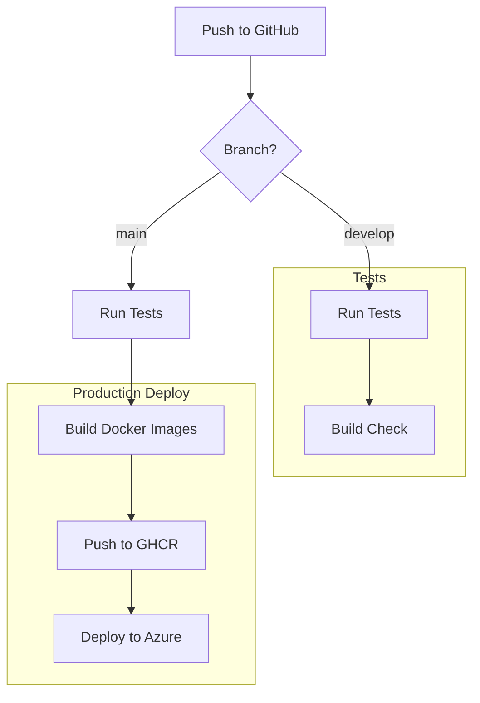

# CI/CD Pipeline Documentation

**Version:** 1.0.0  
**Date:** 2025-12-27  
**Status:** Active  

---

## 1. Overview

This document describes the CI/CD pipeline for the Re:MirAI project using GitHub Actions and Azure deployment.

---

## 2. Pipeline Architecture



---

## 3. Workflow Stages

### 3.1 Test Stage

| Job | Description | Trigger |
|-----|-------------|---------|
| `test-backend` | Run NestJS tests with PostgreSQL | All branches |
| `test-frontend` | Run Next.js lint & build | All branches |

### 3.2 Build Stage

| Job | Description | Trigger |
|-----|-------------|---------|
| `build-images` | Build Docker images | main branch only |
| Push to GHCR | Push images to GitHub Container Registry | main branch only |

### 3.3 Deploy Stage

| Target | Service | Environment |
|--------|---------|-------------|
| Backend | Azure Container Apps | Production |
| Frontend | Azure Static Web Apps | Production |

---

## 4. Required Secrets

```yaml
# GitHub Repository Secrets
AZURE_CREDENTIALS       # Azure service principal JSON
AZURE_STATIC_WEB_APPS_API_TOKEN  # SWA deployment token
```

---

## 5. Local Development

```bash
# Start all services with Docker Compose
docker-compose up -d

# Or run individually
docker-compose up -d postgres  # Database only
cd backend && npm run start:dev
cd frontend && npm run dev
```

---

## 6. Environment Variables

### Backend
| Variable | Description | Required |
|----------|-------------|----------|
| `DATABASE_URL` | PostgreSQL connection string | Yes |
| `JWT_SECRET` | JWT signing key | Yes |
| `OPENAI_API_KEY` | OpenAI API key | Yes |

### Frontend
| Variable | Description | Required |
|----------|-------------|----------|
| `NEXT_PUBLIC_API_URL` | Backend API URL | Yes |
| `NEXT_PUBLIC_WS_URL` | WebSocket URL | Yes |

---

## 7. Docker Images

| Image | Path | Port |
|-------|------|------|
| `remirai/backend` | `/backend/Dockerfile` | 3001 |
| `remirai/frontend` | `/frontend/Dockerfile` | 3000 |
