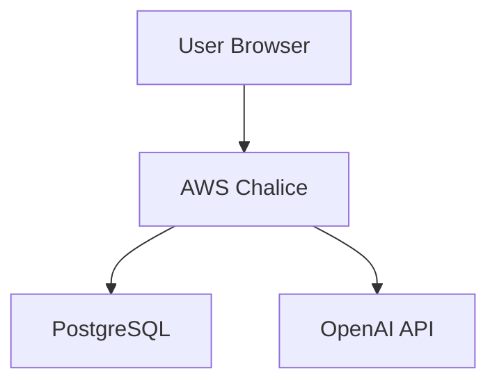

# Technical Writer Review - Re:MirAI Documentation

**Reviewer:** 30-Year Technical Writing Expert  
**Date:** 2025-11-18  
**Scope:** Complete documentation structure and key documents  
**Status:** Comprehensive Review with Recommendations

---

## Executive Summary

The Re:MirAI documentation demonstrates **strong organizational structure** and **comprehensive coverage**, but requires **consistency improvements** and **terminology standardization** to meet enterprise-grade technical writing standards.

### Overall Assessment

| Category | Score | Status |
|----------|-------|--------|
| **Structure & Organization** | 8/10 | ✅ Good |
| **Clarity & Consistency** | 6/10 | ⚠️ Needs Improvement |
| **Completeness** | 7/10 | ✅ Good |
| **Maintainability** | 7/10 | ✅ Good |
| **Accessibility** | 5/10 | ⚠️ Needs Improvement |

---

## 1. Critical Issues (Must Fix)

### 1.1 Terminology Inconsistency

**Problem:** Multiple terms used for the same concept across documents.

**Examples:**
- `project_plan.md`: "Persona AI" (project name)
- `design.md`: "Re:MirAI" (project name)
- `README.md`: "Re:MirAI" (project name)
- `BLONIX_PRIORITY.md`: "Re:MirAI" (project name)

**Impact:** Confusion for new team members and external stakeholders.

**Recommendation:**
```markdown
# Standard Terminology
- **Project Name:** Re:MirAI (always use this)
- **Product Name:** Re:MirAI (same as project)
- **Code Name (Historical):** Persona AI (only in historical context)
```

**Action Items:**
1. Update `project_plan.md` title to "Re:MirAI Project Plan"
2. Add terminology glossary to `docs/GLOSSARY.md`
3. Create style guide with approved terms

---

### 1.2 Design Philosophy Conflict

**Problem:** Documents reference both "Blonix Branch Priority" and legacy "mystical/subculture" terminology.

**Location:** `design.md` line 10, `compliance-summary.md` line 13

**Example:**
```markdown
# design.md (Line 10)
"mystical UI" - contradicts Blonix philosophy

# compliance-summary.md (Line 13)
"Indigo + Purple" - but Blonix uses "Fuchsia/Pink + Blue"
```

**Impact:** Developers may implement wrong design system.

**Recommendation:**
1. **Audit all documents** for legacy terminology
2. **Replace all instances** of:
   - "mystical" → "modern" or "clean"
   - "Indigo + Purple" → "Fuchsia/Pink + Blue" (where Blonix applies)
   - "Dark theme" → "Light theme" (where Blonix applies)
3. **Add deprecation notices** for legacy terms

---

### 1.3 Missing Documentation Index

**Problem:** No central navigation/index for 33+ documentation files.

**Impact:** Users cannot discover relevant documentation efficiently.

**Recommendation:**
Create `docs/README.md` with:
```markdown
# Re:MirAI Documentation Index

## Quick Start
- [Getting Started Guide](getting-started.md)
- [Project Overview](../README.md)

## Design & Architecture
- [Design Philosophy](concept/BLONIX_PRIORITY.md) ⭐ **Start Here**
- [Design System](frontend/design_system.md)
- [Architecture Overview](concept/design.md)

## Development
- [Frontend Guide](frontend/development_guide.md)
- [API Design](plan/api_design.md)
- [Database Schema](plan/database_design.md)

## Compliance & Standards
- [KickoffLabs Compliance](architecture/compliance-summary.md)
- [Color System](architecture/color-palette-audit.md)
- [Z-Index System](architecture/z-index-system.md)

## Page Analysis
- [Landing Page](architecture/page-analysis/landing-page-analysis.md)
- [Dashboard](architecture/page-analysis/dashboard-page-analysis.md)
- [All Pages...](architecture/page-analysis/)

## Planning
- [Project Plan](concept/project_plan.md)
- [UI/UX Design](plan/ui_ux_design.md)
- [Experience Design](plan/experience_design_document.md)
```

---

## 2. Major Issues (Should Fix)

### 2.1 Inconsistent Date Formatting

**Problem:** Dates are inconsistent or missing.

**Examples:**
- `BLONIX_PRIORITY.md`: "Last Updated: 2024" (too vague)
- `compliance-summary.md`: No date
- `project_plan.md`: No date

**Recommendation:**
```markdown
**Last Updated:** 2024-12-XX (use ISO 8601 format: YYYY-MM-DD)
**Version:** 1.0.0 (semantic versioning)
**Status:** Active | Deprecated | Draft
```

---

### 2.2 Missing Document Metadata

**Problem:** Documents lack standard metadata headers.

**Current:**
```markdown
# Document Title
Content...
```

**Recommended:**
```markdown
---
title: Document Title
description: Brief description (50-150 chars)
author: Team/Individual
version: 1.0.0
last_updated: 2024-12-XX
status: active
audience: developers | designers | product | all
---

# Document Title
```

**Benefits:**
- Automated documentation generation
- Better searchability
- Version tracking
- Audience targeting

---

### 2.3 Code Examples Without Context

**Problem:** Code snippets lack explanation or context.

**Example from `design.md` (Lines 132-148):**
```markdown
*   **Master Prompt Structure:**
    ```
    You are an AI Persona named [Name]...
    ```
```

**Issues:**
- No explanation of when/why this is used
- No example with actual values
- No error handling documentation

**Recommendation:**
```markdown
*   **Master Prompt Structure:**
    
    This prompt is generated automatically when a persona is created. It combines:
    - Survey response data
    - Calculated personality stats
    - Selected archetype
    
    **Example with Real Values:**
    ```
    You are an AI Persona named "Alex". Your core identity is that of a 
    SR Tsundere with the title "The Reluctant Protector". Your personality 
    is defined by the following stats, which were derived from the 
    perceptions of your master's friends:
    - [Charisma]: 75/100
    - [Intellect]: 82/100
    ...
    ```
    
    **Error Handling:**
    - If stats are missing: Default to 50/100
    - If archetype is invalid: Fall back to "Neutral"
```

---

### 2.4 Missing Cross-References

**Problem:** Documents don't link to related content.

**Example:** `project_plan.md` mentions "MVP Scope" but doesn't link to detailed MVP documentation.

**Recommendation:**
Add cross-references:
```markdown
## 6. Minimum Viable Product (MVP) Scope

For detailed MVP specifications, see:
- [MVP Technical Specs](../plan/mvp_specs.md)
- [MVP User Stories](../plan/user_stories.md)
- [MVP Timeline](../plan/timeline.md)
```

---

## 3. Minor Issues (Nice to Have)

### 3.1 Inconsistent Heading Styles

**Problem:** Mix of heading styles across documents.

**Examples:**
- Some use `## 1. Numbered Headings`
- Others use `## Heading Name`
- Some use `### Subheading` inconsistently

**Recommendation:**
Standardize to:
```markdown
# Document Title (H1 - only once per document)

## Major Section (H2 - main sections)

### Subsection (H3 - subsections)

#### Detail (H4 - rarely used)
```

---

### 3.2 Missing Table of Contents

**Problem:** Long documents lack navigation.

**Example:** `design_system.md` (390+ lines) has no TOC.

**Recommendation:**
Add auto-generated TOC:
```markdown
# Document Title

## Table of Contents
- [Section 1](#section-1)
- [Section 2](#section-2)
  - [Subsection 2.1](#subsection-21)
```

Or use markdown TOC generators.

---

### 3.3 Inconsistent List Formatting

**Problem:** Mix of bullet styles and numbering.

**Recommendation:**
- Use `-` for unordered lists (consistent spacing)
- Use `1.` for ordered/sequential lists
- Use `*` only for emphasis within text

---

### 3.4 Missing Visual Aids

**Problem:** Complex concepts lack diagrams.

**Example:** `design.md` has ASCII diagram (good) but could use:
- Architecture diagrams (Mermaid/PlantUML)
- User flow diagrams
- Component hierarchy

**Recommendation:**
```markdown
## System Architecture


```

---

## 4. Documentation Structure Assessment

### 4.1 Current Structure (Good)

```
docs/
├── architecture/        ✅ Good organization
├── concept/            ✅ Clear purpose
├── frontend/           ✅ Well-structured
├── plan/               ✅ Strategic docs
└── developer_persona/   ✅ Unique and useful
```

### 4.2 Missing Directories (Recommendations)

```
docs/
├── api/                 ❌ Missing - API documentation
├── guides/             ❌ Missing - User guides
├── troubleshooting/     ❌ Missing - Common issues
├── changelog/          ❌ Missing - Version history
└── glossary/           ❌ Missing - Terminology
```

---

## 5. Content Quality Assessment

### 5.1 Strengths

✅ **Comprehensive Coverage:** All major areas documented  
✅ **Technical Depth:** Good detail on implementation  
✅ **Compliance Tracking:** Excellent audit documentation  
✅ **Page Analysis:** Detailed UX analysis documents  
✅ **Design System:** Well-documented design tokens

### 5.2 Weaknesses

⚠️ **Inconsistent Terminology:** Multiple names for same concepts  
⚠️ **Missing Context:** Some code examples lack explanation  
⚠️ **No User Guides:** Only technical documentation  
⚠️ **Outdated Information:** Some docs reference old design system  
⚠️ **No Search Index:** Hard to find specific information

---

## 6. Recommendations by Priority

### Priority 1: Critical (Do Immediately)

1. **Create Documentation Index** (`docs/README.md`)
   - Central navigation
   - Quick links to all sections
   - Search functionality

2. **Standardize Terminology**
   - Create `docs/GLOSSARY.md`
   - Update all documents to use standard terms
   - Add deprecation notices for old terms

3. **Fix Design Philosophy Conflicts**
   - Audit all documents for Blonix vs. legacy terms
   - Update `compliance-summary.md` with correct colors
   - Remove "mystical" references where Blonix applies

### Priority 2: High (Do This Sprint)

4. **Add Document Metadata**
   - Create template with frontmatter
   - Update key documents
   - Add version numbers

5. **Improve Code Examples**
   - Add context and explanations
   - Include real-world examples
   - Document error handling

6. **Add Cross-References**
   - Link related documents
   - Create "See Also" sections
   - Add breadcrumbs

### Priority 3: Medium (Do Next Sprint)

7. **Standardize Formatting**
   - Create style guide
   - Fix heading inconsistencies
   - Standardize list formatting

8. **Add Visual Aids**
   - Architecture diagrams (Mermaid)
   - User flow diagrams
   - Component hierarchy

9. **Create Missing Documentation**
   - API documentation (`docs/api/`)
   - Troubleshooting guide
   - Changelog

### Priority 4: Low (Backlog)

10. **Enhancement Features**
    - Auto-generated TOC
    - Search functionality
    - Documentation versioning system
    - Automated link checking

---

## 7. Style Guide Recommendations

### 7.1 Writing Style

**Current:** Mix of formal and informal  
**Recommendation:** Professional but approachable

**Guidelines:**
- Use active voice: "The system processes..." not "Processing is done by..."
- Be concise: Remove unnecessary words
- Use consistent tense: Present tense for current state, past for history
- Define acronyms: "AI (Artificial Intelligence)" on first use

### 7.2 Terminology Standards

**Approved Terms:**
- **Re:MirAI** (project/product name)
- **Persona** (AI character, capitalized when referring to entity)
- **Survey** (not "Ritual" in user-facing docs)
- **Feedback Collection** (not "Summoning" in user-facing docs)
- **Blonix Branch** (design system name)

**Deprecated Terms:**
- ~~Persona AI~~ → Re:MirAI
- ~~Ritual~~ → Survey (in user-facing context)
- ~~Summoning~~ → Persona Creation/Generation
- ~~Mystical~~ → Modern/Clean (in Blonix context)

---

## 8. Documentation Maintenance Plan

### 8.1 Review Schedule

- **Weekly:** Check for broken links, outdated info
- **Monthly:** Review one major section
- **Quarterly:** Full documentation audit
- **Per Release:** Update changelog and version numbers

### 8.2 Ownership

**Recommendation:** Assign documentation owners:
- **Design System:** Design Team
- **API Documentation:** Backend Team
- **Frontend Guides:** Frontend Team
- **Architecture:** Tech Lead
- **User Guides:** Product Team

### 8.3 Quality Gates

Before merging documentation PRs:
- [ ] Terminology matches glossary
- [ ] All links work
- [ ] Code examples tested
- [ ] Metadata complete
- [ ] Reviewed by domain expert

---

## 9. Specific Document Reviews

### 9.1 `BLONIX_PRIORITY.md` ⭐ Good

**Strengths:**
- Clear structure
- Actionable guidelines
- Good use of examples

**Improvements:**
- Add "Last Updated" with specific date
- Add version number
- Link to related design system docs
- Add "See Also" section

### 9.2 `project_plan.md` ⚠️ Needs Work

**Issues:**
- Title says "Persona AI" but should be "Re:MirAI"
- Missing date/version
- No cross-references
- MVP section could link to detailed specs

**Recommendations:**
- Update title
- Add metadata header
- Add links to related docs
- Expand MVP section with links

### 9.3 `design.md` ⚠️ Needs Work

**Issues:**
- References "mystical UI" (contradicts Blonix)
- Code examples lack context
- No visual diagrams for architecture
- Missing error handling documentation

**Recommendations:**
- Replace "mystical" with "modern/clean"
- Add context to code examples
- Add Mermaid diagram for architecture
- Document error scenarios

### 9.4 `compliance-summary.md` ✅ Good

**Strengths:**
- Clear status indicators
- Good verification steps
- Useful file list

**Improvements:**
- Update colors to Blonix (Fuchsia/Pink + Blue)
- Add last updated date
- Add version number
- Link to detailed audit docs

---

## 10. Conclusion

The Re:MirAI documentation demonstrates **strong technical depth** and **comprehensive coverage**, but requires **consistency improvements** and **standardization** to meet enterprise standards.

### Immediate Actions (This Week)

1. Create `docs/README.md` (Documentation Index)
2. Create `docs/GLOSSARY.md` (Terminology)
3. Fix terminology in `project_plan.md` and `design.md`
4. Update `compliance-summary.md` with Blonix colors

### Short-term Goals (This Month)

5. Add metadata to all key documents
6. Improve code examples with context
7. Add cross-references between documents
8. Standardize formatting across all docs

### Long-term Goals (This Quarter)

9. Create missing documentation (API, troubleshooting)
10. Add visual diagrams
11. Implement documentation versioning
12. Set up automated quality checks

---

## Appendix: Documentation Checklist Template

Use this for new documentation:

```markdown
## Documentation Checklist

### Content
- [ ] Clear, concise title
- [ ] Purpose statement in first paragraph
- [ ] Target audience identified
- [ ] All technical terms defined
- [ ] Code examples tested and working
- [ ] Real-world examples included

### Structure
- [ ] Logical information hierarchy
- [ ] Table of contents (if > 500 words)
- [ ] Consistent heading styles
- [ ] Proper list formatting
- [ ] Cross-references to related docs

### Quality
- [ ] Spelling and grammar checked
- [ ] Terminology matches glossary
- [ ] Links verified
- [ ] Images optimized and accessible
- [ ] Metadata complete

### Maintenance
- [ ] Last updated date
- [ ] Version number
- [ ] Owner assigned
- [ ] Review schedule set
```

---

**Review Completed:** 2025-11-18  
**Next Review:** 2026-02-18 (Quarterly)  
**Reviewer:** Technical Writing Team

