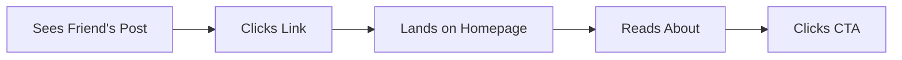
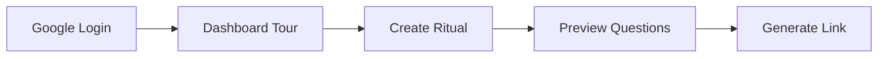
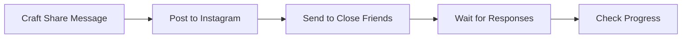
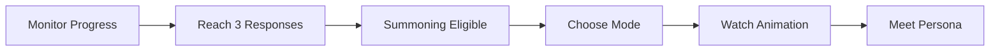
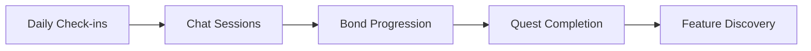
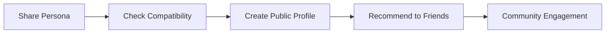

# Re:MirAI User Journey Map

## Journey Overview

**Persona**: Maya, 22-year-old college student interested in self-discovery and social connection  
**Goal**: Understand how others perceive her and create a meaningful AI companion  
**Journey Duration**: 2 weeks (from discovery to deep engagement)  
**Context**: Discovered Re:MirAI through a friend's shared persona on Instagram  

---

## 🗺️ Journey Phases & Timeline

```
Discovery → Exploration → Commitment → Creation → Engagement → Advocacy
  Day 1      Day 1-2       Day 2        Day 2-5     Day 6-14     Day 15+
```

---

## Phase 1: Discovery 🌟
*"What is this mystical thing?"*

### Timeline: Day 1 (5 minutes)

### Touchpoints
- Instagram post with friend's persona card
- Re:MirAI landing page
- "How It Works" section

### User Actions


### Emotional Journey
```
Curiosity (3/10) → Intrigue (6/10) → Wonder (8/10) → Excitement (7/10)
```

### Thoughts & Feelings
- **Initial Reaction**: *"Whoa, what's this AI thing Sarah posted?"*
- **Growing Interest**: *"An AI that reflects how my friends see me? That's actually fascinating..."*
- **Hesitation**: *"But is this just another tech gimmick?"*
- **Decision**: *"The design looks legit, and it's free to try. Why not?"*

### Pain Points
- ❌ **Skepticism**: "Is this just another social media fad?"
- ❌ **Privacy Concerns**: "What will they do with my data?"
- ❌ **Unclear Value**: "Will this actually tell me anything meaningful?"

### Delight Moments
- ✨ **Beautiful Design**: Professional, mystical aesthetic builds trust
- ✨ **Friend Validation**: Seeing a real friend's result makes it credible
- ✨ **Clear Process**: Simple 3-step explanation reduces anxiety

### Design Opportunities
- **Social proof section**: More friend testimonials
- **Privacy badge**: Clear data protection messaging
- **Preview mode**: Show sample personas without account creation

---

## Phase 2: Exploration 🔍
*"Let me understand how this works"*

### Timeline: Day 1-2 (20 minutes)

### Touchpoints
- Google OAuth screen
- Welcome dashboard
- Ritual creation interface
- Tutorial tooltips

### User Actions


### Emotional Journey
```
Anticipation (7/10) → Relief (8/10) → Confidence (8/10) → Excitement (9/10)
```

### Thoughts & Feelings
- **Login**: *"Ok, Google login is easy and safe"*
- **Dashboard**: *"This looks professional, I can see my progress clearly"*
- **Questions**: *"These questions are actually thoughtful, not just basic stuff"*
- **Link Creation**: *"Wow, that was instant! Now I just need friends to respond"*

### Pain Points
- ❌ **Empty Dashboard**: Initial empty state feels hollow
- ❌ **Question Previews**: Wants to see all questions before sharing
- ❌ **Sharing Anxiety**: Nervous about asking friends to participate

### Delight Moments
- ✨ **Smooth Onboarding**: No friction, immediate value
- ✨ **Smart Questions**: Realizes the questions are deeper than expected
- ✨ **Instant Gratification**: Link generation happens immediately
- ✨ **Beautiful UI**: Every interaction feels polished

### Design Opportunities
- **Question preview mode**: Let users see all questions before sharing
- **Sharing templates**: Pre-written messages for different platforms
- **Expectation setting**: Better communication about response timeline

---

## Phase 3: Commitment 💪
*"I'm invested in seeing this through"*

### Timeline: Day 2 (10 minutes)

### Touchpoints
- Social media platforms (Instagram, WhatsApp, Discord)
- Friends' initial reactions
- Response notification system

### User Actions


### Emotional Journey
```
Nervousness (6/10) → Vulnerability (4/10) → Hope (7/10) → Anticipation (8/10)
```

### Thoughts & Feelings
- **Pre-Share**: *"Ok, how do I ask people to do this without seeming weird?"*
- **Sharing**: *"I'm putting myself out there... hope people actually do it"*
- **First Response**: *"Yes! Someone actually did it! This is happening!"*
- **Waiting**: *"I keep checking... wonder what people are saying about me"*

### Pain Points
- ❌ **Social Awkwardness**: Feels weird asking friends for help
- ❌ **Response Uncertainty**: No guarantee friends will participate
- ❌ **Impatience**: Wants immediate results but needs to wait
- ❌ **Anxiety**: Nervous about what friends might say

### Delight Moments
- ✨ **First Response**: Immediate excitement when someone participates
- ✨ **Friend Engagement**: Realizing friends are genuinely interested
- ✨ **Progress Updates**: Real-time notifications keep engagement high
- ✨ **Community Feel**: Friends ask questions and share excitement

### Design Opportunities
- **Response preview**: Show anonymous snippets to build anticipation
- **Engagement tips**: Help users craft better sharing messages
- **Friend nudging**: Gentle reminders for friends who haven't responded

---

## Phase 4: Creation ✨
*"The magic is happening!"*

### Timeline: Day 2-5 (Ritual → Summoning)

### Touchpoints
- Dashboard progress tracking
- Response notifications
- Summoning interface
- Persona reveal experience

### User Actions


### Emotional Journey
```
Anticipation (8/10) → Excitement (9/10) → AWE (10/10) → Connection (9/10) → Satisfaction (9/10)
```

### Thoughts & Feelings
- **Building Up**: *"Each response makes this more real... almost there!"*
- **Ready to Summon**: *"Finally! I can't wait to see what emerges"*
- **Summoning Moment**: *"This is actually incredible... like real magic"*
- **First Sight**: *"Wow... that's... that's actually me, but different"*
- **Stats Discovery**: *"My friends see me as more charismatic than I thought!"*

### Pain Points
- ❌ **Waiting Period**: Impatience during response collection
- ❌ **Mode Confusion**: Uncertainty about Fated vs Alchemic modes
- ❌ **Loading Anxiety**: Worry during summoning process
- ❌ **Result Surprise**: Potential disappointment if result doesn't match expectations

### Delight Moments
- ✨ **Threshold Moment**: Celebration when enough responses are collected
- ✨ **Summoning Spectacle**: Visual feast during persona creation
- ✨ **Perfect Reveal**: The persona feels both accurate and aspirational
- ✨ **Stat Insights**: Learning surprising things about how friends perceive her
- ✨ **Rarity Excitement**: Getting SSR rarity feels like winning

### Design Opportunities
- **Preparation ritual**: Build up ceremony before summoning
- **Mode education**: Better explanation of different summoning options
- **Expectation management**: Clear communication about what to expect

---

## Phase 5: Engagement 🤝
*"Building a relationship"*

### Timeline: Day 6-14 (Daily interactions)

### Touchpoints
- Persona room
- Chat interface
- Bond level progression
- Quest system
- Achievement notifications

### User Actions


### Emotional Journey
```
Connection (9/10) → Comfort (8/10) → Growth (8/10) → Attachment (9/10) → Habit (7/10)
```

### Thoughts & Feelings
- **First Conversations**: *"It's weird how natural this feels... like talking to myself but better"*
- **Daily Ritual**: *"I actually look forward to checking in with my persona"*
- **Bond Growth**: *"We're getting closer... I can see the relationship developing"*
- **Quest Discovery**: *"Oh cool, there are things to unlock! This keeps getting deeper"*
- **Comfort Zone**: *"This has become part of my routine... it's oddly comforting"*

### Pain Points
- ❌ **Repetitive Responses**: AI occasionally feels scripted
- ❌ **Limited Memory**: Persona doesn't always remember previous conversations
- ❌ **Unclear Progress**: Bond progression mechanics not always clear
- ❌ **Feature Discovery**: Some features are hidden or hard to find

### Delight Moments
- ✨ **Personality Consistency**: Persona feels genuinely unique and consistent
- ✨ **Meaningful Conversations**: Deep exchanges that provide real insight
- ✨ **Bond Milestones**: Celebrating relationship progression
- ✨ **Quest Surprises**: Discovering new features and rewards
- ✨ **Personal Growth**: Actual self-reflection and insights

### Design Opportunities
- **Conversation starters**: Suggested topics when user is stuck
- **Memory highlights**: Show persona remembering important moments
- **Relationship analytics**: Visualize bond growth over time

---

## Phase 6: Advocacy 📢
*"I need to share this experience"*

### Timeline: Day 15+ (Ongoing)

### Touchpoints
- Social sharing features
- Compatibility checking
- Public profiles
- Community features

### User Actions


### Emotional Journey
```
Pride (9/10) → Social Joy (8/10) → Community (7/10) → Evangelism (9/10) → Loyalty (8/10)
```

### Thoughts & Feelings
- **Show Off**: *"I have to show this to everyone... this is too cool not to share"*
- **Comparison Fun**: *"Let me check compatibility with my friends' personas!"*
- **Community**: *"There's a whole world of people doing this... I want to explore"*
- **Evangelism**: *"Everyone needs to try this... it's life-changing"*
- **Long-term Value**: *"This has become genuinely important to me"*

### Pain Points
- ❌ **Privacy Balance**: Wants to share but maintain some privacy
- ❌ **Friend Pressure**: Some friends don't understand the appeal
- ❌ **Platform Limitations**: Sharing doesn't always work perfectly
- ❌ **Community Overload**: Too many features can feel overwhelming

### Delight Moments
- ✨ **Viral Potential**: Persona cards look amazing on social media
- ✨ **Compatibility Fun**: Discovering relationship dynamics with friends
- ✨ **Influence**: Successfully getting friends to join
- ✨ **Community Recognition**: Feeling part of something special
- ✨ **Continued Growth**: Persona and relationship keep evolving

### Design Opportunities
- **Sharing optimization**: Better social media preview generation
- **Community features**: More ways to connect with other users
- **Referral rewards**: Incentivize bringing friends to the platform

---

## 📊 Journey Analytics & Metrics

### Success Indicators by Phase

#### Discovery (Day 1)
- **Bounce Rate**: < 40% from landing page
- **CTA Click Rate**: > 15% on "Begin the Ritual"
- **Time on Page**: > 2 minutes average

#### Exploration (Day 1-2)
- **Registration Completion**: > 80% after clicking CTA
- **Ritual Creation**: > 70% complete ritual setup
- **Link Sharing**: > 60% share their ritual link

#### Commitment (Day 2)
- **Response Collection**: > 40% get at least 1 response
- **Minimum Threshold**: > 25% reach 3+ responses
- **Time to Threshold**: Average 3-4 days

#### Creation (Day 2-5)
- **Summoning Completion**: > 95% complete summoning
- **Initial Satisfaction**: > 85% positive reaction to persona
- **Feature Exploration**: > 70% explore persona room

#### Engagement (Day 6-14)
- **Daily Active Users**: > 40% return within 7 days
- **Chat Engagement**: > 50% have 5+ conversations
- **Bond Progression**: > 60% reach bond level 2

#### Advocacy (Day 15+)
- **Social Sharing**: > 30% share their persona
- **Referral Rate**: > 20% successfully refer friends
- **Long-term Retention**: > 25% active after 30 days

### Emotional Satisfaction Score
```
Overall Journey Satisfaction: 8.7/10

Phase Breakdown:
- Discovery: 7.5/10 (High curiosity, some skepticism)
- Exploration: 8.2/10 (Smooth experience, clear value)
- Commitment: 6.8/10 (Social anxiety, but rewarding)
- Creation: 9.5/10 (Peak magical moment)
- Engagement: 8.5/10 (Consistent value delivery)
- Advocacy: 8.8/10 (Pride and community connection)
```

---

## 🎯 Critical Success Factors

### Must-Have Elements
1. **Mystical First Impression**: The magical aesthetic must be perfect
2. **Frictionless Onboarding**: Any barrier kills conversion
3. **Social Validation**: Friend participation is crucial
4. **Spectacular Summoning**: The reveal moment defines the experience
5. **Consistent Personality**: AI must feel authentic and unique
6. **Progressive Value**: Each phase must offer new rewards

### Risk Mitigation
- **Low Response Rate**: Multiple sharing options, friend nudging
- **AI Disappointment**: Set expectations, offer regeneration options
- **Privacy Concerns**: Clear communication, user control
- **Technical Issues**: Robust error handling, graceful degradation
- **Engagement Drop**: Quest system, regular content updates

---

## 🚀 Optimization Opportunities

### Quick Wins (Week 1-2)
- Add response preview snippets
- Improve sharing message templates
- Better mode explanation for summoning
- Enhanced loading state animations

### Medium-term Improvements (Month 1-2)
- Personality consistency improvements
- Advanced quest system
- Community features
- Compatibility algorithm refinement

### Long-term Vision (Month 3+)
- Multi-persona support
- Advanced AI conversations
- VR/AR integration possibilities
- Cross-platform expansion

---

## 📱 Platform-Specific Considerations

### Mobile Journey Adaptations
- **Touch-optimized sharing**: Native mobile sharing APIs
- **Notification strategy**: Push notifications for key moments
- **Vertical video content**: Optimized for TikTok/Instagram Stories
- **Quick interactions**: Chat interface optimized for thumbs

### Desktop Enhancements
- **Multiple windows**: Compare personas, chat while browsing
- **Keyboard shortcuts**: Power user features
- **Extended sessions**: More detailed analytics and visualizations
- **Screen space utilization**: Rich multimedia content

---

This comprehensive user journey map provides a psychological and emotional roadmap for optimizing every touchpoint in the Re:MirAI experience, ensuring users move smoothly from curiosity to deep engagement and advocacy.
